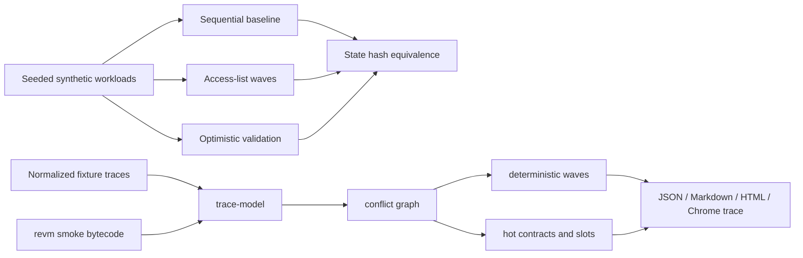

# parallel-revm-lab

Deterministic parallel execution and EVM workload analysis in Rust.

This repository is a protocol-engineering lab for studying deterministic parallel execution, EVM-shaped state contention, and real workload bottlenecks. It is not a production execution client, does not replay full blocks, and does not claim production TPS or gas throughput.

## What This Is

`parallel-revm-lab` has three layers:

- A synthetic scheduler lab that proves sequential equivalence for two parallel execution strategies.
- A normalized EVM trace analyzer that turns fixture block traces into conflict graphs, waves, hot-state rankings, and reproducible reports.
- A minimal `revm` smoke crate that executes tiny bytecode fixtures and feeds derived storage observations into the same analyzer.

Real EVM contention matters because optimistic or access-list parallel execution is only useful when the block has enough independent state access. This repo makes that structure visible without hiding scheduler overhead or provider trace caveats.

## What It Demonstrates

- Deterministic state, access-key, delta, and stable hash model.
- Sequential baseline, access-list wave scheduler, and optimistic validation executor.
- Seeded synthetic workloads with configurable conflict pressure and optional deterministic `--vm-steps` CPU work.
- Normalized fixture parsing for EVM-like account, code, balance, nonce, and storage access observations.
- Deterministic conflict graph, dependency waves, critical path, hot contract and hot storage slot rankings.
- JSON, Markdown, static HTML, and Chrome trace schedule reports.
- A compiling `revm 40.0.3` smoke path using in-memory state and tiny bytecode fixtures.

## Quick Start

```sh
cargo test --workspace --all-features
cargo run -p parallel-revm-lab -- --help
cargo run -p parallel-revm-lab -- inspect --workload mixed --txs 12 --conflict 0.5 --seed 42
```

## Analyze Fixture

Fixture mode is the reliable local and CI path:

```sh
cargo run -p parallel-revm-lab -- analyze-fixture \
  --fixture fixtures/base-mini-trace.json \
  --out reports/base-mini-trace.parallelism.json \
  --markdown reports/base-mini-trace.md \
  --html reports/base-mini-trace.html \
  --trace reports/base-mini-trace.schedule.trace.json
```

Committed sample output from the synthetic Base-shaped fixture:

- 12 transactions
- 7 conflict pairs
- 10.606% pairwise conflict rate
- 3 deterministic waves
- max wave width 7
- critical path length 3
- theoretical parallelism ceiling 4.000x

The fixture is synthetic and is not claimed to be real Base chain data.

## Analyze Block

`analyze-block` is the live-RPC surface, but provider trace APIs differ and live RPC is not required in CI:

```sh
cargo run -p parallel-revm-lab -- analyze-block \
  --chain base \
  --block 38014901 \
  --rpc-url "$BASE_RPC_URL" \
  --out reports/base-38014901.parallelism.json \
  --markdown reports/base-38014901.md \
  --html reports/base-38014901.html
```

`--rpc-url` is preferred over `BASE_RPC_URL` or `ETH_RPC_URL`. The CLI does not print RPC URLs. Live trace normalization is intentionally documented as best-effort future work until provider-specific trace formats are implemented.

## Validate

```sh
cargo fmt --all -- --check
cargo clippy --workspace --all-targets --all-features -- -D warnings
cargo test --workspace --all-features
cargo run -p parallel-revm-lab -- verify --workload mixed --txs 100 --conflicts 0.0,0.2,0.5,0.7,0.95 --threads 1,2,4 --seed-start 1 --seed-end 20
```

If `just` is installed:

```sh
just validate
```

## Benchmark

```sh
cargo run --release -p parallel-revm-lab -- bench \
  --workload storage \
  --txs 1000 \
  --conflict 0.0 \
  --mode all \
  --threads 4 \
  --seed 42 \
  --vm-steps 50000 \
  --out reports/storage-c0-vmsteps.json
```

Reports use synthetic scheduler/workbench throughput. They are not full-node throughput numbers. `--vm-steps` is deterministic CPU work, not gas, opcodes, IO, or database latency.

## Architecture



## Correctness Story

The synthetic executor invariant is:

```text
hash(sequential(txs)) == hash(access_list(txs)) == hash(optimistic(txs))
```

The trace analyzer does not execute transactions. It proves structural properties of a normalized access trace:

- conflict pairs are derived from write/write, write/read, and read/write overlap
- dependencies point from earlier conflicting transactions to later ones
- waves partition transaction indices exactly once
- each conflict dependency crosses to a later wave
- reports use deterministic sorting and stable hashes

The `revm-smoke` crate proves that real EVM bytecode can be executed in-process and bridged into this analyzer for small fixture programs. It does not claim general trace extraction.

## Limitations

- The synthetic state model is EVM-shaped, not full EVM semantics.
- Fixture trace quality determines analyzer quality; incomplete reads make conflict counts lower bounds.
- `analyze-block` currently fails clearly unless live RPC trace normalization is implemented for the target provider.
- The revm smoke path derives observations from known bytecode fixtures rather than a general inspector.
- Benchmarks measure scheduler behavior on synthetic transactions only.
- The state/report hashes are stable FNV-1a hashes, not cryptographic commitments.

## Repository Map

- `crates/model`: deterministic state, transactions, deltas, conflict detection, stable hashing.
- `crates/workload`: seeded synthetic workload generation.
- `crates/executor`: sequential, access-list, optimistic execution, reports, traces.
- `crates/trace-model`: normalized EVM/block access trace types and fixture parsing.
- `crates/analyzer`: conflict graph, waves, hot-state rankings, and report renderers.
- `crates/revm-smoke`: minimal compiling revm bytecode smoke bridge.
- `crates/cli`: `parallel-revm-lab` command-line interface.
- `fixtures/base-mini-trace.json`: committed synthetic fixture.
- `reports/base-mini-trace.*`: committed fixture report artifacts.
- `docs/trace-analysis.md`: trace model and RPC caveats.
- `docs/parallelism-report.md`: report interpretation.
- `docs/engineering-log.md`: validation history and engineering decisions.

## What To Review In 90 Seconds

1. `crates/analyzer/src/lib.rs`: conflict graph, wave builder, report hash.
2. `crates/trace-model/src/lib.rs`: normalized access model and fixture validation.
3. `crates/revm-smoke/src/lib.rs`: minimal revm bridge.
4. `crates/executor/src/lib.rs`: synthetic scheduler correctness path.
5. `reports/base-mini-trace.html`: fixture analysis artifact.
6. `docs/trace-analysis.md` and `docs/correctness.md`: limitations and invariants.
