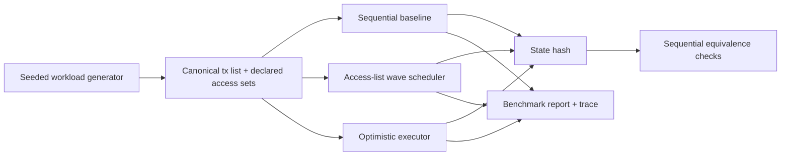

# parallel-revm-lab

Deterministic conflict-aware parallel execution workbench for synthetic EVM-shaped state transitions.

The thesis is simple: keep the final state identical to sequential execution, reduce wall-clock time when access sets allow it, and degrade honestly when contention is high. This is not a blockchain client and it does not claim production TPS.

## Why This Is Hard

Parallel execution can race in subtle ways: two transactions may touch the same account, a read may be invalidated by an earlier commit, or a scheduler may accidentally make output depend on worker timing. This repo keeps those edges visible by using deterministic state, canonical transaction order, explicit access sets, and sequential equivalence tests.

## What It Demonstrates

- Deterministic account, nonce, contract storage, access-key, delta, and state-hash model.
- Sequential baseline executor.
- Access-list wave scheduler with parallel execution and canonical commit order.
- Optimistic executor with speculative reads, validation, and deterministic re-execution.
- Seeded workloads with configurable conflict pressure.
- Optional deterministic `--vm-steps` CPU work to simulate heavier interpreter execution.
- JSON benchmark reports and minimal Chrome trace output.
- Tests that assert parallel final state equals sequential final state.

## Quick Start

```sh
cargo test --workspace --all-features
cargo run -p parallel-revm-lab -- --help
cargo run -p parallel-revm-lab -- inspect --workload mixed --txs 12 --conflict 0.5 --seed 42
```

## One-Command Validation

```sh
cargo fmt --all -- --check
cargo clippy --workspace --all-targets --all-features -- -D warnings
cargo test --workspace --all-features
cargo run -p parallel-revm-lab -- verify --workload mixed --txs 100 --conflicts 0.0,0.2,0.5,0.7,0.95 --threads 1,2,4 --seed-start 1 --seed-end 20
```

If `just` is installed:

```sh
just validate
```

## One-Command Benchmark

```sh
cargo run --release -p parallel-revm-lab -- bench \
  --workload mixed \
  --txs 1000 \
  --conflict 0.5 \
  --mode all \
  --threads 4 \
  --seed 42 \
  --out reports/mixed-c50.json \
  --trace reports/mixed-c50.trace.json
```

Reports use synthetic tx/s for this scheduler workbench. They are not full-node throughput numbers.

To simulate heavier interpreter work per synthetic transaction:

```sh
cargo run --release -p parallel-revm-lab -- bench \
  --workload storage \
  --txs 1000 \
  --conflict 0.0 \
  --mode all \
  --threads 4 \
  --seed 42 \
  --vm-steps 50000 \
  --out reports/storage-c0-vmsteps.json
```

`--vm-steps` runs deterministic CPU work inside each synthetic transaction. It does not model gas, opcodes, IO, database access, or production client throughput.

## Architecture



## Benchmark Snapshots

Cheap mixed transactions, generated by the first benchmark command above:

| mode | synthetic tx/s | speedup vs sequential | deterministic | notes |
| --- | ---: | ---: | --- | --- |
| sequential | 1,352,876.08 | baseline | true | `vm_steps=0`, state hash `ac90d19c91175700` |
| access-list | 17,868.76 | 0.013x | true | 309 waves; scheduling overhead dominates this small batch |
| optimistic | 1,137,009.66 | 0.840x | true | 731 validation failures and re-executions |

The raw report is `reports/mixed-c50.json`.

Heavier low-contention storage transactions, generated by the second benchmark command above:

| mode | synthetic tx/s | speedup vs sequential | deterministic | notes |
| --- | ---: | ---: | --- | --- |
| sequential | 10,763.02 | baseline | true | `vm_steps=50000`, state hash `1940c0cfba64e3cb` |
| access-list | 34,784.98 | 3.232x | true | 4 waves; parallelism beats scheduling overhead |
| optimistic | 23,182.58 | 2.154x | true | 173 validation failures and re-executions |

The raw report is `reports/storage-c0-vmsteps.json`.

## Correctness Story

The core invariant is sequential equivalence: for the same initial state and transaction list, both parallel modes must produce exactly the same final state hash and state contents as sequential execution.

- The access-list scheduler builds waves whose transactions have no read/write or write/write conflicts, executes each wave against a pre-wave snapshot, then commits deltas in canonical transaction order.
- The optimistic executor speculates on a snapshot, validates observed reads against the evolving committed state, and re-executes invalidated transactions before commit.
- Benchmark reports split declared conflict pairs, scheduler deferrals, validation failures, re-executions, wave count, and max wave width.
- State uses deterministic `BTreeMap`/`BTreeSet` ordering and an explicit stable FNV-1a hash over canonical bytes.

## Limitations

- The state model is EVM-shaped, not a full EVM implementation.
- Access lists are declared by the synthetic transaction generator.
- Benchmarks measure scheduler behavior on synthetic transactions only.
- `--vm-steps` is a deterministic CPU loop for exploring scheduler overhead versus per-transaction execution cost; it is not an EVM interpreter.
- The `revm` adapter is documented as future work; no broken feature-gated adapter is included.

## Repository Map

- `crates/model`: state, transactions, deltas, conflict detection, stable hashing.
- `crates/workload`: seeded workload generation and conflict measurement.
- `crates/executor`: sequential, access-list, optimistic execution, reports, traces.
- `crates/cli`: `parallel-revm-lab` command-line interface.
- `docs/design.md`: architecture and tradeoffs.
- `docs/correctness.md`: invariants and tests.
- `docs/benchmarks.md`: commands and benchmark interpretation.
- `docs/failures.md`: real failures found during implementation.

## What To Review In 90 Seconds

1. `crates/executor/src/lib.rs`: scheduler and optimistic validation logic.
2. `crates/model/src/lib.rs`: transaction semantics and stable state hash.
3. `crates/executor/src/lib.rs` tests: sequential equivalence and property tests.
4. `docs/correctness.md`: what the tests prove and do not prove.
5. `reports/mixed-c50.json` and `reports/storage-c0-vmsteps.json`: generated benchmark reports for cheap and heavier synthetic transactions.
