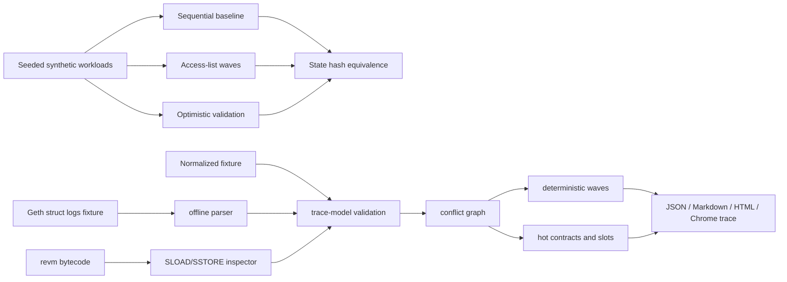

# parallel-revm-lab

Deterministic parallel execution and EVM trace-access analysis in Rust.

This repository is a protocol-engineering lab for studying deterministic parallel execution, EVM-shaped state contention, offline trace access patterns, and real `revm` bytecode storage observation. It is not a production execution client, does not replay full blocks, and does not claim production TPS or gas throughput.

## Working Commands

Verify the synthetic scheduler invariant:

```sh
cargo run -p parallel-revm-lab -- verify \
  --workload mixed \
  --txs 100 \
  --conflicts 0.0,0.2,0.5,0.7,0.95 \
  --threads 1,2,4 \
  --seed-start 1 \
  --seed-end 20
```

Run the heavy low-contention benchmark snapshot:

```sh
cargo run --release -p parallel-revm-lab -- bench \
  --workload storage \
  --txs 1000 \
  --conflict 0.0 \
  --mode all \
  --threads 4 \
  --seed 42 \
  --vm-steps 50000 \
  --out reports/storage-c0-vmsteps.json
```

Current committed storage snapshot: access-list `3.187x` and optimistic `2.285x` vs sequential on synthetic `vm_steps=50000` work.

Analyze an offline Geth-style struct-log fixture:

```sh
cargo run -p parallel-revm-lab -- analyze-trace \
  --format geth-struct-logs \
  --fixture fixtures/geth-mini-struct-logs.json \
  --out reports/geth-mini.parallelism.json \
  --markdown reports/geth-mini.md \
  --html reports/geth-mini.html \
  --trace reports/geth-mini.schedule.trace.json
```

Current Geth mini report: 3 txs, 1 conflict pair, 2 deterministic waves, max width 2, hash `1c9e9d1d244efdde`.

## What Is Real Vs Synthetic

| Layer | Real? | What it proves | What it does not prove |
| --- | --- | --- | --- |
| synthetic scheduler | synthetic | deterministic parallel execution invariant | EVM semantics |
| trace analyzer | normalized/offline trace | conflict, wave, hot-state analysis | full RPC coverage |
| revm smoke | real `revm` bytecode | integration path and inspector-captured storage observation | full block replay |

## What It Demonstrates

- Deterministic state, access-key, delta, and stable hash model.
- Sequential baseline, access-list wave scheduler, and optimistic validation executor.
- Seeded synthetic workloads with configurable conflict pressure and optional deterministic `--vm-steps` CPU work.
- Validated normalized fixtures: addresses must be `0x` plus 40 hex chars; storage keys and tx hashes must be `0x` plus 64 hex chars.
- Offline `geth-struct-logs` parsing for tiny sanitized fixtures, deriving storage slots from `SLOAD` and `SSTORE` stack values.
- Deterministic conflict graph, dependency waves, critical path, hot contract and hot storage slot rankings.
- JSON, Markdown, static HTML, and Chrome trace schedule reports.
- A compiling `revm 40.0.3` smoke path with an inspector that records `SLOAD` and `SSTORE`.

## Fixture Analysis

Normalized fixture mode remains the simplest deterministic review path:

```sh
cargo run -p parallel-revm-lab -- analyze-fixture \
  --fixture fixtures/base-mini-trace.json \
  --out reports/base-mini-trace.parallelism.json \
  --markdown reports/base-mini-trace.md \
  --html reports/base-mini-trace.html \
  --trace reports/base-mini-trace.schedule.trace.json
```

Committed Base-shaped synthetic fixture summary:

- 12 transactions
- 7 conflict pairs
- 10.606% pairwise conflict rate
- 3 deterministic waves
- max wave width 7
- critical path length 3
- theoretical parallelism ceiling 4.000x
- hash `3df71a7c236db9d9`

The fixture is synthetic and is not claimed to be real Base chain data.

## Validation

```sh
cargo fmt --all -- --check
cargo clippy --workspace --all-targets --all-features -- -D warnings
cargo test --workspace --all-features
```

If `just` is installed:

```sh
just validate
```

## Architecture



## Correctness Story

The synthetic executor invariant is:

```text
hash(sequential(txs)) == hash(access_list(txs)) == hash(optimistic(txs))
```

The trace analyzer does not execute blocks. It proves structural properties of normalized access observations:

- conflict pairs are derived from write/write, write/read, and read/write overlap
- dependencies point from earlier conflicting transactions to later ones
- waves partition transaction indices exactly once
- each conflict dependency crosses to a later wave
- reports use deterministic sorting and stable hashes

The `revm-smoke` crate executes real bytecode through `revm` and records storage access through an inspector. It does not claim full block replay or complete account/code/balance observation.

## Future RPC Support

`analyze-block` remains an experimental CLI surface and intentionally fails clearly unless a provider-specific trace normalizer is implemented. The public, tested ingestion paths today are `analyze-trace` and `analyze-fixture`.

## Limitations

- The synthetic state model is EVM-shaped, not full EVM semantics.
- Offline trace quality determines analyzer quality; incomplete reads make conflict counts lower bounds.
- The Geth struct-log parser only supports the committed tiny fixture shape and records `SLOAD`/`SSTORE` storage access.
- The revm smoke inspector records storage opcodes only; account, balance, nonce, and code reads are not represented.
- Benchmarks measure scheduler behavior on synthetic transactions only.
- The state/report hashes are stable FNV-1a hashes, not cryptographic commitments.

## Repository Map

- `crates/model`: deterministic state, transactions, deltas, conflict detection, stable hashing.
- `crates/workload`: seeded synthetic workload generation.
- `crates/executor`: sequential, access-list, optimistic execution, reports, traces.
- `crates/trace-model`: normalized trace types, validation, fixture parsing, and Geth struct-log parsing.
- `crates/analyzer`: conflict graph, waves, hot-state rankings, and report renderers.
- `crates/revm-smoke`: minimal revm bytecode smoke bridge with storage inspector.
- `crates/cli`: `parallel-revm-lab` command-line interface.
- `fixtures/base-mini-trace.json`: synthetic normalized fixture with valid EVM hex values.
- `fixtures/geth-mini-struct-logs.json`: sanitized tiny Geth-style struct-log fixture.
- `reports/base-mini-trace.*` and `reports/geth-mini.*`: committed report artifacts.
- `docs/trace-analysis.md`: trace formats and RPC caveats.
- `docs/parallelism-report.md`: report interpretation.
- `docs/engineering-log.md`: validation history and engineering decisions.

## What To Review In 90 Seconds

1. `crates/trace-model/src/lib.rs`: validation and Geth struct-log parser.
2. `crates/revm-smoke/src/lib.rs`: real revm inspector storage observation.
3. `crates/analyzer/src/lib.rs`: conflict graph, wave builder, report hash.
4. `fixtures/geth-mini-struct-logs.json`: offline parser fixture.
5. `reports/geth-mini.html` and `reports/base-mini-trace.html`: report artifacts.
6. `docs/trace-analysis.md` and `docs/revm-integration-notes.md`: limitations and next steps.
